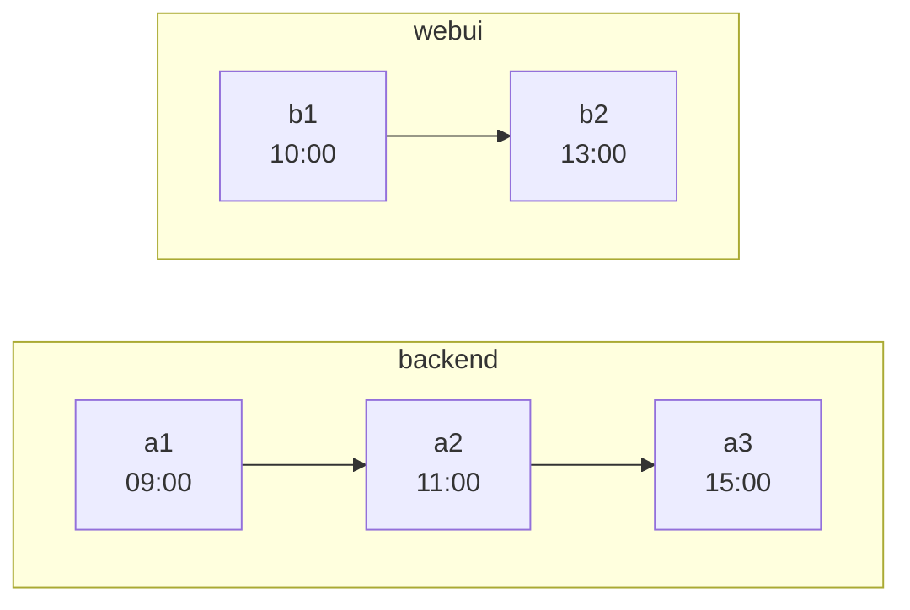
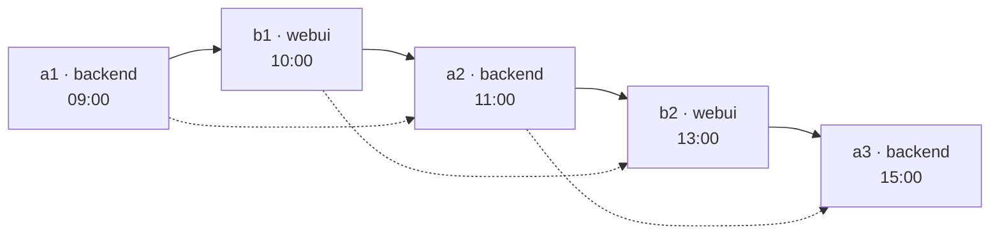

# git-timebraid

Merge several independent git repositories into one — **braided together along the time axis**.

Every commit of every input repository is recreated, every original parent edge is kept, and on top of
that the tool inserts artificial edges that chain commits across repositories in chronological order —
by committer date, unless you ask for author date. The result is a single mainline — *the braid* — that
interleaves the histories of all inputs.

Check out any commit on the braid and you see the state that **all** input repositories had at that
moment in time.

---

## The problem this solves

You have three repositories that were always developed together — a backend, a web UI, a code
generator. They were released together, they broke together, and the interesting question is almost
always *"what did the whole system look like on the day that bug appeared?"*

Git's usual answers do not give you that. `git subtree`, `git read-tree`, `git filter-repo
--to-subdirectory-filter`, and the plain `git merge --allow-unrelated-histories` recipe all join the
repositories at a **single point**: from the merge commit onwards you have one repository, but every
commit *before* it still belongs to exactly one original repository and shows only that repository's
files. Your history is preserved but it is not usable as a joint history. (Tools like
[josh](https://github.com/josh-project/josh) solve a different problem again — projecting
subdirectories in and out as workspace views.)

git-timebraid joins them **at every commit**.

---

## How it looks

Two repositories, one afternoon of work:



Braided:



Solid arrows are the braided edges the tool adds. Dotted arrows are the original edges, all of them
still there. Arrows point from parent to child, so time flows left to right.

Checking out `b2` gives you `backend/` as of `a2` and `webui/` as of `b2` — the state of the world at
13:00.

---

## The parent rule

The braid is built from the **first-parent chain** of each input repository's mainline branch. Those
chains are merged into one sequence by always taking whichever chain's next commit is oldest — a k-way
merge, the same idea as merging sorted lists. A chain's own order never changes regardless of what its
timestamps say, so ancestry on the mainline holds by construction; across repositories, the earlier
timestamp comes first. Which timestamp that is — the committer date, or the author date with
`--order-by author` — is settled once when the input is read, and the rest of this document calls it
the **ordering timestamp**.

For every commit `c`, writing `pred` for the commit preceding it in that sequence:

```
c is not on the braid          →  parents'(c) = parents(c)             unchanged
pred is already a parent of c  →  parents'(c) = parents(c)             unchanged
otherwise                      →  parents'(c) = [pred] + parents(c)    braided edge prepended
```

That is the whole rule. Note what it does **not** do: it never removes a parent. The braided edge is
*prepended*, so it becomes the first parent — which is what makes `git log --first-parent` walk the
braid — while every original edge stays exactly where it was.

The arithmetic follows:

| commit in its original repo | predecessor on the braid | parents in the braid |
|---|---|---|
| ordinary commit | same repo (i.e. already its parent) | **1** — unchanged |
| ordinary commit | a different repo | **2** — braided edge + original parent |
| merge commit | a different repo | **3** — braided edge + both original parents |

The three-parent case is not a curiosity, it is the price of the guarantee. Suppose `webui` merged a
feature branch, and the commit immediately preceding that merge in time came from `backend`:

```
original:   parents(b3)  = [b2, f1]           b3 merges the feature branch f1 into b2
braid:      parents'(b3) = [a4, b2, f1]
                            │   └── b2 and f1: every original edge, untouched
                            └─────── a4: the braided edge, i.e. the commit
                                    preceding b3 in time
```

Drop `b2` here and you would have a tidier graph and a false history: `git merge-base`, `git log
--first-parent webui-side`, and every "when did this diverge" question would start lying. So it keeps
all three.

---

## The tree rule

A commit's tree in the braid is derived from its first parent:

> **tree'(c)** = the tree of `parents'(c)[0]`, with the entry for `c`'s own subdirectory replaced by
> `c`'s original tree.

For the very first commit on the braid there is no parent, so the tree is just that one subdirectory.

Because the first parent is the time predecessor, the map of *subdirectory → content* accumulates as
you walk forward. Each subdirectory holds whatever its repository last committed at or before this
point, and a repository that did not exist yet simply is not there:

```
$ git ls-tree HEAD                    # today
040000 tree a11ce09…    codegen
040000 tree 7f3d2b8…    backend
040000 tree c4e5a10…    webui

$ git ls-tree HEAD~5000               # before webui was started
040000 tree a11ce09…    codegen
040000 tree 2d81f4c…    backend
```

This is the mechanism behind the whole promise: "the state of every repository at that moment" is not
computed on demand, it is simply what the commit's tree contains.

---

## What this buys you: bisecting across repositories

The point of all this is that **a moment in time becomes a commit you can check out**.

Say the nightly integration run was green on Tuesday and red on Friday. In between, `backend` gained
forty commits and `webui` gained twelve. The failure shows up in the UI, but nobody knows which side
actually caused it.

With separate repositories you cannot bisect that. You can bisect `backend` alone, but at each step you
have to decide by hand which `webui` commit was current at the time, check that one out too, and hope
you paired them correctly. Six bisect steps, and every one of them needs that pairing rebuilt by hand.

In the braid it is the ordinary command:

```bash
git bisect start friday-commit tuesday-commit
# build and run the integration test at each step
git bisect run ./ci/integration-test.sh
```

Every commit git offers you is a real historical state of the whole system: `backend/` holds whatever
backend had last committed at that instant, `webui/` likewise. Not an approximation and not a
reconstruction — that combination is what existed. The pairing is no longer something you maintain, and
the commit bisect lands on tells you both *which repository* and *which change*.

The same property answers the other questions of that shape without any tooling at all:

```bash
# what did webui ship on a given day
git show "$(git rev-list -n1 --before=2024-03-15 main)":webui/package.json

# everything everyone did, as one timeline
git log --first-parent --since=2024-03-01

# what changed in the backend between two releases
git diff release-2.1 release-2.2 -- backend/
```

**One caveat worth stating plainly.** "That instant" means *the mainline branches at that instant*, as
dated by the ordering timestamp — not what was deployed. If work is authored long before it is merged,
author dates and integration order diverge; `--order-by committer` is usually the better choice for
"what did the system look like" questions, and `--order-by author` for "what was being written".

**A second, sharper caveat: a merge can carry — and pass on — a repository's future.** A merge commit's
tree already reflects everything it merged in, including a branch whose last commit is timestamped
after the merge itself; nothing about braiding changes that tree, and every later commit that inherits
it forward (the ordinary accumulation rule, not a choice this tool makes) shows that same "future"
content too. This is a fact about the input history — a branch merged back in later than it was last
committed to, the everyday case — not something any interleaving of the braid can undo.

The braid itself adds nothing to this. Every braid edge — the artificial one this tool inserts — runs
from a commit back to one no younger than itself: a braid predecessor from another repository won a
direct comparison of timestamps against it, and a predecessor from the commit's *own* repository is
already its first parent, so no edge is added there at all. Suppose `backend`'s `m` merges in a
long-lived feature branch whose last commit is timestamped after `m` itself. Checking out `m` shows
`webui/` as of a moment at or before `m`'s own — the braid places nothing later beside it. What you see
from the future is only what `m`'s own tree already carried, and what any later commit inherits from
it. "The state of the world at this moment" is exact precisely when every commit's timestamp is
consistent with all of its parents', not only its first one.

That guarantee is the default's, and `--interleave-ref` is how you trade it away deliberately. Name a
ref and its commits may delay a mainline merge that merges them in: the merge then lands by *their*
time rather than by its own, which is arguably the more honest position for a merge whose content
reaches later than its own date — and which does let the merge acquire a braid predecessor younger
than itself. Off by default, because a branch nobody considers significant should not get to move where
two other repositories meet.

---

## Branches

Branches need no special handling, which is worth explaining because it looks like they should.

Only commits on the braid get reparented. Everything else keeps its original parents, and branches are
just refs pointing at the recreated commits. So a side branch forks off wherever its base commit landed
— and if that base is on the braid, it already carries the accumulated content of every repository.

The consequence is that a branch which exists in **one** input repository still gives you a working
checkout of the whole system:

```
$ git ls-tree esbuild-experiment      # a branch that only ever existed in webui
040000 tree a11ce09…    codegen
040000 tree 7f3d2b8…    backend
040000 tree e90b7a3…    webui
```

`codegen/` and `backend/` are frozen at whatever they were when the branch was cut, and `webui/`
follows the branch. Which is exactly what you want, and it costs no configuration.

---

## What ends up in the output repository

- **One subdirectory per input repository**, named after the input's own name, which in turn
  defaults to the last segment of its path. The two are set separately:
  `repo.git::name` is the repository's identity — the tag prefix, the provenance label, what
  `--root-repo` matches, and what has to be unique, so it is how two inputs whose directories happen
  to share a name are told apart — while `repo.git=subdir` only says where the content lands. One
  repository may be placed at the root instead, with `--root-repo <name>`.
- **All branches**, recreated at the corresponding new commits. Restrict with `-b`. The mainline
  branch collapses into one: every input contributed its own to the same braid, so the output has a
  single branch of that name, at the braid's tip. Any other branch keeps its own name, unless two
  inputs happen to have used that name — then both are qualified as `<repo>/<branch>`.
- **All tags**, prefixed with the repository name by default (`v1.2` from `webui` becomes
  `webui/v1.2`), so tags from different repositories cannot collide. An annotated tag stays
  annotated, keeping its tagger and its message.
- **The original repositories as remotes** (with `--keep-remotes`), their branches fetched under
  `refs/remotes/<repo>/*`. Nothing is lost and the originals stay one `git log` away.
- **A provenance trailer** on every commit message:

  ```
  webui: fix the date picker on the summary page

  [timebraid: repo="webui" commit=5c1a9f2… parents=b2c91f4…,a0d3e11…]
  ```

  This is what makes the guarantee checkable rather than merely claimed: the original identity and the
  original parents of every commit are recorded, so a script can verify that no edge went missing.
  Turn it off with `--no-provenance`.

---

## Usage

### Requirements

- Java 17 or newer
- `git` on `PATH` (used for cloning and fetching; all object writing is done in-process)

### Install

No release has been published yet, so build the distribution from source:

```bash
mvn -q package                       # builds target/git-timebraid-<version>.tar.gz (and .zip)
tar xzf target/git-timebraid-*.tar.gz -C ~/opt
export PATH="$HOME/opt/git-timebraid-<version>/bin:$PATH"

git-timebraid --help
git timebraid --help                 # the same thing: git runs any git-<name> found on PATH
```

The archive is `bin/git-timebraid` (plus `git-timebraid.bat` for Windows) beside
`lib/git-timebraid.jar`; the launcher finds the jar relative to itself, through symlinks, so linking
`bin/git-timebraid` into a directory already on `PATH` works too.

`JAVA_HOME` selects the JVM if set, `java` from `PATH` otherwise. `JAVA_OPTS` goes to the JVM, which
is where a larger heap belongs for a large history:

```bash
JAVA_OPTS=-Xmx4g git-timebraid -o /tmp/merged ~/repos/backend.git ~/repos/webui.git
```

The jar is self-contained (all dependencies shaded in), so skipping the archive works as well:

```bash
java -jar target/git-timebraid.jar --help
```

### Examples

Merge three local bare clones, each into its own subdirectory:

```bash
git-timebraid -o /tmp/merged \
    --mainline-branch develop \
    ~/repos/backend.git ~/repos/webui.git ~/repos/codegen.git
```

Put the backend at the repository root and place `webui` in `ui/`, keeping its own name (so its
tags stay `webui/v1.2`):

```bash
git-timebraid -o /tmp/merged \
    --root-repo backend --mainline-branch main \
    ~/repos/backend.git ~/repos/webui.git=ui ~/repos/codegen.git
```

Recreate only two branches, and inspect the plan without writing anything:

```bash
git-timebraid \
    --mainline-branch main \
    -b main -b release/2.2 \
    --dry-run --plan-out /tmp/plan.txt \
    ~/repos/backend.git ~/repos/webui.git
```

### Options

```
git-timebraid -o <dir> [OPTIONS] <repo>[::<name>][=<subdir>]...

  -o, --output DIR              output repository (must not exist unless --force)
      --force                   write into an existing output directory (deletes nothing)
      --root-repo REPO          repository whose content lands at the repository root
      --mainline-branch NAME    branch treated as the mainline in every input
                                (default: first of main/master/develop present in all)
      --order-by author|committer
                                timestamp used to interleave the strands
                                (default: committer)
  -b, --branch NAME             recreate only these branches (repeatable; default: all)
      --interleave-ref PATTERN  let this ref's commits delay a mainline merge that merges
                                them in (repeatable; glob over full ref names; default: none)
      --tag-prefix FMT          default "{repo}/"
      --subject-prefix FMT      default "{subdir}: "
      --[no-]provenance         provenance trailer (default: on)
      --bare / --no-bare        default: bare
      --keep-remotes            add inputs as remotes, fetch into refs/remotes/<repo>/*
      --dry-run                 compute and summarize the plan, write nothing
      --plan-out FILE           dump the deterministic plan as text
  -q, --quiet / -v, --verbose
```

---

## Status

**Usable from the command line end to end.** Cloning the inputs (a local path or a URL), reading them,
planning the interleaving, writing the output — bare or with a working tree — recreating every branch
and prefixed tag, the provenance trailer, keeping the inputs as remotes, and progress on stderr: all
implemented and tested. The pipeline is covered by a matrix of end-to-end fixtures — a three-parent
merge on the mainline, `--root-repo`, side branches, committer-clock skew, tree dedup, `a.txt` vs
`a/` ordering, CRLF and non-ASCII content, the error paths — each run through `git fsck --strict`,
plus an opt-in smoke run against a real corpus. On a three-repository history of 14 000 commits the
result passes `git fsck --strict`, and walking the provenance trailers finds every original parent
edge present in the output. CI runs `mvn verify` on Linux and Windows against JDK 17 and 21. A URL
input is cloned next to the output under `.timebraid-clones/`; a second run over the same URL
refreshes that clone instead of downloading it again.

`mvn package` produces the runnable artifacts: a self-contained jar and a `tar.gz`/`zip` holding it
together with the `git-timebraid` launcher (see Install).

Not there yet:

- **A published release.** The archives exist but are built locally; nothing is uploaded anywhere yet,
  and there is no native binary — running the tool needs a JVM.

## Limitations

- **Commit SHAs change.** Rewriting parents rewrites identity; this is unavoidable and permanent. Use
  the provenance trailer to map new commits back to the originals.
- **GPG signatures do not survive.** A signature covers the parent list, so rewriting parents
  invalidates it. Signatures are dropped rather than kept in an invalid state.
- **Inputs must be complete clones.** Shallow clones and partial clones are rejected — the tool needs
  the entire commit graph.
- **Subdirectory names must not collide** with entries of the `--root-repo` at its top level.
- **The whole commit graph is held in memory.** Hundreds of thousands of commits will want a larger
  heap. This is a batch tool run once per merge, not a daemon.
- **The output is written as one uncompressed pack** and comes out larger than the inputs, because
  objects are copied whole rather than as deltas. `git gc` in the output repository recovers the
  difference; nothing is missing either way.
- **Not transferred:** submodules, `refs/notes/*`, reflogs, and any repository-local configuration.

## License

Apache License 2.0 — see [LICENSE](LICENSE) and [NOTICE](NOTICE).
