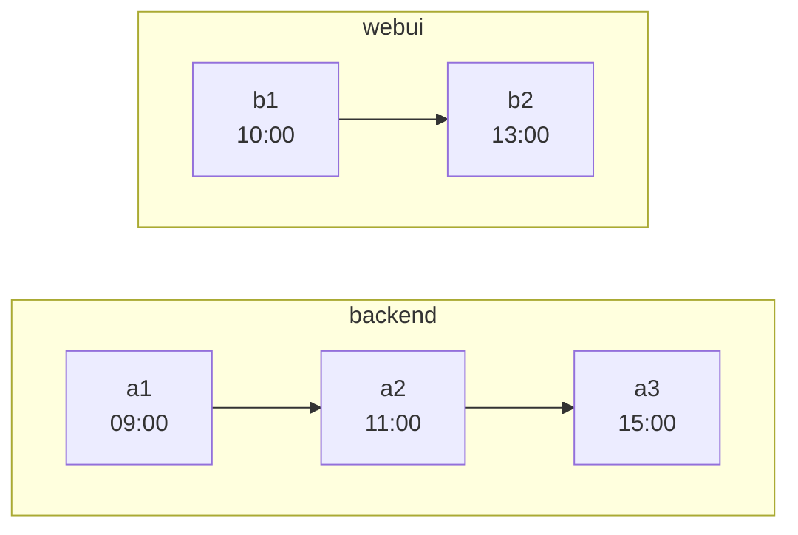
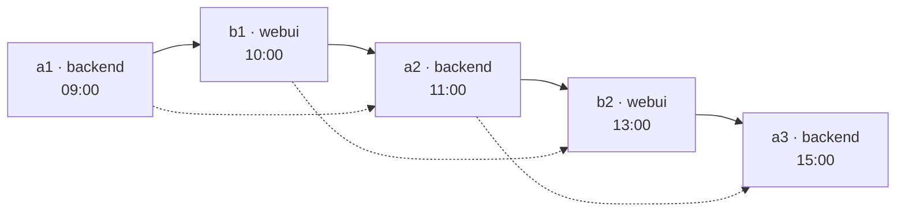

# git-timebraid

Merge several independent git repositories into one — **braided together along the time axis**.

- Every commit the selected refs reach is recreated, and by default that is every branch and tag.
- Every original parent edge is kept.
- On top of that, artificial edges chain commits *across* repositories in chronological order — by
  committer date, unless you ask for author date.

The result is a single mainline — *the braid* — that interleaves the histories of all inputs. Check
out any commit on it and you see the state that **all** input repositories had at that moment.

---

## The problem this solves

You have three repositories that were always developed together — a backend, a web UI, a code
generator. They were released together, they broke together, and the interesting question is almost
always *"what did the whole system look like on the day that bug appeared?"*

Git's usual answers do not give you that:

- `git subtree`, `git read-tree`, `git filter-repo --to-subdirectory-filter` and the plain
  `git merge --allow-unrelated-histories` recipe all join the repositories at a **single point**.
- From the merge commit onwards you have one repository — but every commit *before* it still belongs
  to exactly one original repository and shows only that repository's files.
- Your history is preserved, but it is not usable as a joint history.
- [josh](https://github.com/josh-project/josh) solves a different problem again — projecting
  subdirectories in and out as workspace views.

git-timebraid joins them **at every commit**.

---

## How it looks

Two repositories, one afternoon of work:



Braided:



- Solid arrows: the braided edges the tool adds.
- Dotted arrows: the original edges, all of them still there.
- Arrows point from parent to child, so time flows left to right.

Checking out `b2` gives you `backend/` as of `a2` and `webui/` as of `b2` — the state of the world at
13:00.

---

## How the braid is built

Three rules, in short:

- **Order.** Each input's mainline first-parent chain is a strand; the strands are merged into one
  sequence by always taking whichever strand's next commit is oldest by the **ordering timestamp** —
  the committer date, or the author date with `--order-by author`. A strand's own order is never
  disturbed, so ancestry within a repository holds by construction.
- **Parents.** The commit preceding `c` in that sequence is *prepended* to `c`'s parent list. Nothing
  is ever removed, so every original edge survives — and because the braided edge comes first,
  `git log --first-parent` walks the braid.
- **Trees.** A commit's tree is its first parent's tree with its own destination swapped in. Content
  therefore accumulates along the braid: each subdirectory holds whatever its repository last
  committed at or before this point, and a repository that did not exist yet is simply not there.
  A subdirectory entry *is* the input's own tree object, so no blob is copied — the one file the braid
  writes for itself is the root `.gitmodules`, which git reads from nowhere else.

Which is where the promise at the top of this page comes from: that state is not computed when you
ask for it, it is what the commit already holds.

[**doc/how-it-works.md**](doc/how-it-works.md) works the construction out properly — the exact parent
rule, why a merge on the braid can end up with three parents, and what happens to side branches.
[**doc/examples/**](doc/examples/README.md) is the same thing on small histories you can build and
walk yourself — some on the order the commits end up in, others on where their content lands and
which refs come with it.

---

## What this buys you: bisecting across repositories

The point of all this is that **a moment in time becomes a commit you can check out**.

Say the nightly integration run was green on Tuesday and red on Friday. In between, `backend` gained
forty commits and `webui` gained twelve. The failure shows up in the UI, but nobody knows which side
actually caused it.

With separate repositories you cannot bisect that. You can bisect `backend` alone, but at each step
you have to decide by hand which `webui` commit was current at the time, check that one out too, and
hope you paired them correctly. Six bisect steps, and every one of them needs that pairing rebuilt by
hand.

In the braid it is the ordinary command, run in a clone of the output, since the output itself is
bare unless written with `--no-bare` and bisect wants a working tree to build in:

```bash
git bisect start --first-parent friday-commit tuesday-commit
# build and run the integration test at each step
git bisect run ./ci/integration-test.sh
```

Every commit git offers you along the first parent, which is the braid, is a real historical state of
the whole system: `backend/` holds whatever backend had last committed at that instant, `webui/`
likewise. Not an approximation and not a reconstruction — that combination is what existed. The
pairing is no longer something you maintain, and the commit bisect lands on tells you both *which
repository* and *which change*. A commit on a side branch is not such a state: it holds what its
fork point held plus the branch, which is why the bisect keeps to the first parent (git 2.29 or
later).

The same property answers the other questions of that shape without any tooling at all:

```bash
# what did webui ship on a given day
git show "$(git rev-list --first-parent -n1 --before=2024-03-15 main)":webui/package.json

# everything everyone did, as one timeline
git log --first-parent --since=2024-03-01

# what changed in the backend between two releases
git diff backend/release-2.1 backend/release-2.2 -- backend/
```

**Two limits on reading that literally.** "That instant" means the *mainline* branches as dated by
the ordering timestamp, not what was deployed; and a merge commit's tree can carry content timestamped
after the merge itself, which every later commit then inherits. Neither is something braiding
introduces, and both are worked through under [Caveats](doc/how-it-works.md#caveats).

---

## What ends up in the output repository

**One subdirectory per input repository**, named after the input's own name, which in turn defaults to
the last segment of its path. Name and placement are set separately:

- `repo.git::name` is the repository's **identity** — the tag prefix, the provenance label, what
  `--root-repo` matches, and what has to be unique. It is how two inputs whose directories happen to
  share a name are told apart.
- `repo.git::=subdir` says **where the content lands**, and under the default `--subject-prefix` it
  also heads the subject of each commit from that repository. It may be a nested path
  (`repo.git::=libs/backend`), and inputs sharing a prefix share the directory for it — so
  `backend.git::=libs/backend webui.git::=apps/webui` gives the output a `libs/` and an `apps/`.
  Two inputs may not contain each other — `libs` and `libs/backend` — unless **`--splice`** says so:
  an input's content is placed as its own tree object, and nothing fits beside a single object, so
  the containing repository's tree has to be opened up instead. What that never buys is a merge of
  two repositories' files: anything the containing repository already holds at the inner
  destination is a collision, with or without the flag — with one entry excepted, below.
- One repository may be placed at the root instead, with `--root-repo <name>`. That is the same
  splice, and the one that needs no flag — every other destination is inside it, which is what the
  option asked for. Its own entries at a path and the inputs placed inside it end up in one
  directory.

Worked through on repositories you can build and walk: [nested destinations and a shared
prefix](doc/examples/05-nested-layout/README.md), and [`--splice`](doc/examples/06-splice/README.md)
— which also shows the pair being refused without the flag, and the collision the flag does not
excuse.

### Dissolving a submodule into its content

Where an input lands on exactly the path the repository around it keeps a **gitlink**, that
repository was already saying another repository belongs there — and the input is that repository,
arriving with its history rather than as one pinned sha. `--dissolve-submodules` lets it take the
gitlink's place instead of colliding with it, and drops the submodule's section from the output's
`.gitmodules` so nothing is left claiming a path that now holds real content.

```console
$ git-timebraid -o out.git --root-repo super --dissolve-submodules \
    super.git lib.git::=vendor/lib
dissolved: the submodule at vendor/lib in super replaced by its own content at 214 commits
```

It is opt-in because the substitution is not a faithful expansion. A gitlink names one commit of the
submodule; what lands in its place is whatever that input had reached at each point of the braid, so
the output's `vendor/lib` moves with the braid rather than with the superproject's pin. Two things
it deliberately does not do: a gitlink at a segment *above* a destination stays an error (nothing is
placed at that path, so there is no content to put in the submodule's stead), and an ordinary file or
directory in the way stays a collision.

[Example 07](doc/examples/07-dissolve-submodule/README.md) is this on a real superproject with two
submodules, one of them dissolved and one left alone, with the output's trees listed at four points
of the braid and the root `.gitmodules` quoted at the tip.

### Taking the layout off a directory tree

`--scan <dir>` reads the layout instead of having it written out: every repository under `<dir>`
becomes an input, placed in the output where it sits on disk. A repository at `<dir>/libs/backend`
lands at `libs/backend`, a bare `<dir>/libs/backend.git` lands there too, and `<dir>` itself lands at
the output root when it is a repository — which is `--root-repo` reached another way, not a second
concept.

Two rules decide what is looked at, and both keep the scan predictable rather than clever:

- **A repository is not descended into.** What is nested inside one — a submodule, a vendored
  checkout, a linked worktree — is its own business, and pulling those in is a decision rather than
  a default. The base directory is the exception; a scan that stopped at it would find nothing else.
- **Dot-names and symlinks are skipped**, so a `.cache` or a mirrored directory is never walked.

The run's own `-o` is never a finding either, however it is spelled, so rerunning into a
`merged.git` beside the inputs does not braid it into itself; an argument naming the output, or an
`-o` naming the `.git` of a working tree the scan finds, is refused.

A `<repo>` argument may be given alongside, and one whose location is a directory the scan found, or
that directory's `.git`, is a **correction to that finding** rather than a second input: the name it
gives wins, and the subdirectory too when it gives one, while an argument that gives none leaves the
finding where the scan put it. That is what settles two findings that derive the same name —
`libs/core` and `tools/core` — which is refused until one of them is named:

```
git-timebraid -o out.git --scan ~/repos ~/repos/tools/core::tools-core
```

Anything the scan skipped, or a repository from outside the tree entirely, is added the same way:
as an ordinary argument.

[Example 08](doc/examples/08-scan/README.md) scans a tree holding all of these cases at once — a
bare repository, a dot-name, a repository nested inside another, and the two findings that derive
the same name.

### How an input is written

```
<path-or-url>[::[<name>][=<subdir>]]
```

Everything before the **last `::`** is the location, taken verbatim; everything after it is the name
and the subdirectory. That is the whole rule — nothing is guessed, and an argument that cannot be
read this way is refused rather than quietly reread.

Two things follow, and between them they cover every location there is:

- **The location needs no escaping**, `=` and `::` included. `~/repos/a=b` is simply a path. When
  the location itself holds a `::`, end the argument with a bare `::` to say where it stops:
  `~/repos/odd::name::` is that whole path with no name given, which asks for the derived one. That
  settles the location, not the name: a name derived from a last segment git would not take in a
  ref is refused, so the working spelling here is `~/repos/odd::name::oddname`. The bare `::` is
  also what an IPv6 URL needs —
  `https://[fe80::1]/repo.git::` — and what every refusal that comes out of a suffix suggests.
- **In the name and the subdirectory**, `\` escapes: `\=`, `\\` and `\:` in the subdirectory, and
  `\=` alone in a name, which cannot hold a `\` or a `:` (git refuses both in a ref). A bare `:` is
  refused in either, which is what guarantees that an encoded suffix can never contain a `::` of its
  own — so the last `::` in the argument is always the separator.

```bash
~/repos/webui.git                     # name and subdirectory both 'webui'
~/repos/webui.git::frontend           # name 'frontend', subdirectory 'frontend'
~/repos/webui.git::=apps/webui        # derived name 'webui', subdirectory 'apps/webui'
~/repos/webui.git::ui=apps/webui      # name 'ui', subdirectory 'apps/webui'
~/repos/a=b/c                         # a location holding a '='
~/repos/odd::name::oddname            # a location holding a '::', named
```

A name is held to what git takes as one segment of a ref name: no `/`, no `:`, no space. That is
not a gap: the name becomes a directory name for the clone of a remote input and a segment of a tag
name, so one segment is what it means.

**All branches**, recreated at the corresponding new commits (narrow with `-b` or `--ref`):

- The mainline branch collapses into one: every input contributed its own to the same braid, so the
  output has a single branch of that name, at the braid's tip.
- Any other branch keeps its own name — unless two inputs happen to have used that name, in which
  case both are qualified as `<repo>/<branch>`.

**All tags**, prefixed with the repository name by default (`v1.2` from `webui` becomes `webui/v1.2`),
so tags from different repositories cannot collide. An annotated tag stays annotated, keeping its
tagger and its message.

`-b` and `--ref` are one selection rather than two: `-b main` *is* `--ref refs/heads/main`, and
naming any ref at all leaves out every ref not named. So a run narrowed to a branch carries no tags
unless it says so — write both halves out to keep them:

```bash
--ref 'refs/heads/main' --ref 'refs/tags/*'
```

`*` is the only metacharacter and it spans path separators, so `refs/heads/release/*` reaches a
nested branch name however deep. Matching is against the *full* ref name because a short one cannot
say whether `v1.0` is a branch or a tag. The mainline is loaded whatever the patterns say — the
braid is built along it — and the output's branch of that name comes from the braid's tip.

**The original commits**, with their own shas intact, next to the rewritten ones. The output is
filled by fetching into it everything the refs that were read reach — that is what puts the inputs'
trees and blobs there, which the braid then reuses — and a fetch cannot leave the commits out.
Nothing points at them by default, so they are invisible to `git log` and `git gc --prune=now`
reclaims them; `--keep-remotes` points `refs/remotes/<name>/*` at every branch the run carried over,
each input's mainline among them, and — under `tags/` — at every tag it carried over instead, so
the originals those reach stay one `git log` away.
Either way the fetch covers the refs that were read, so narrowing the selection narrows what
arrives: a commit only an unselected ref could reach is not merely unreferenced in the output, its
objects are not there.

**A provenance trailer** on every commit message:

```
webui: fix the date picker on the summary page

[timebraid: repo="webui" commit=5c1a9f2… parents=b2c91f4…,a0d3e11…]
```

This is what makes the guarantee checkable rather than merely claimed: the original identity and the
original parents of every commit are recorded, so a script can verify that no edge went missing. Turn
it off with `--no-provenance`.

---

## Usage

### Requirements

- Java 17 or newer
- `git` on `PATH` — only to clone a remote input and refresh that clone on a later run, to record
  the inputs as remotes under `--keep-remotes`, and to check out a `--no-bare` output; reading the
  inputs, transferring their objects and writing the braid all happen in-process

### Install

Download an archive from [Releases](https://github.com/loplex/git-timebraid/releases), unpack it, and
put its `bin/` on `PATH`:

```bash
mkdir -p ~/opt
tar xzf git-timebraid-<version>.tar.gz -C ~/opt
export PATH="$HOME/opt/git-timebraid-<version>/bin:$PATH"

git-timebraid --help
git timebraid -h                     # the same thing: git runs any git-<name> found on PATH,
                                     # but takes --help for itself and looks for its own page
```

Each release carries a `SHA256SUMS`; `sha256sum --check --ignore-missing SHA256SUMS` verifies what
you downloaded against it.

Building from source produces the same archive:

```bash
mvn -q package                       # builds target/git-timebraid-<version>.tar.gz (and .zip)
```

The archive is `bin/git-timebraid` (plus `git-timebraid.bat` for Windows) beside
`lib/git-timebraid.jar`. The launcher finds the jar relative to itself, through symlinks, so linking
`bin/git-timebraid` into a directory already on `PATH` works too.

The JVM is picked in this order, first hit wins:

1. `TIMEBRAID_JAVA` — names a java binary outright
2. `runtime/` beside the launcher — present only in the bundled-runtime archive (see below)
3. `JAVA_HOME`
4. `java` from `PATH`

`JAVA_OPTS` goes to the JVM, which is where a larger heap belongs for a large history:

```bash
JAVA_OPTS=-Xmx4g git-timebraid -o /tmp/merged ~/repos/backend.git ~/repos/webui.git
```

The jar is self-contained (all dependencies shaded in), so skipping the archive works as well:

```bash
java -jar target/git-timebraid.jar --help
```

#### Without a JVM installed

`-Pbundled-runtime` adds a second archive carrying a trimmed JVM built with `jlink`, for machines
where installing Java is not on the table:

```bash
mvn -q -Pbundled-runtime package      # adds git-timebraid-<version>-<os>-<arch>.tar.gz (and .zip)
```

- It unpacks and runs the same way; the launcher notices `runtime/` beside it and uses that JVM in
  preference to `JAVA_HOME`, which is the point of the archive.
- `TIMEBRAID_JAVA=/path/to/java` overrides that when you would rather it ran on yours.
- Roughly 55 MB unpacked on Linux, 46 MB of it the runtime, against 9 MB for the plain jar.
- Unlike the plain archive it only runs on the platform that built it — hence the platform in the
  file name.
- It is the JDK running Maven that gets bundled, and `--compress=zip-6` needs JDK 21 or newer; on
  JDK 17 build it with `-Djlink.compress=2`.

### Examples

Merge three local bare clones, each into its own subdirectory:

```bash
git-timebraid -o /tmp/merged \
    --mainline-branch develop \
    ~/repos/backend.git ~/repos/webui.git ~/repos/codegen.git
```

Group the inputs under a layout of your own, two of them sharing `libs/`:

```bash
git-timebraid -o /tmp/merged \
    ~/repos/backend.git::=libs/backend \
    ~/repos/codegen.git::=libs/codegen \
    ~/repos/webui.git::=apps/webui
```

Put the backend at the repository root and place `webui` in `ui/`, keeping its own name (so its
tags stay `webui/v1.2`):

```bash
git-timebraid -o /tmp/merged \
    --root-repo backend --mainline-branch main \
    ~/repos/backend.git ~/repos/webui.git::=ui ~/repos/codegen.git
```

Carry over two branches and the tags of one release series, and inspect the plan without writing
the output repository:

```bash
git-timebraid \
    --mainline-branch main \
    -b main -b release/2.2 --ref 'refs/tags/v2.*' \
    --dry-run --plan-out /tmp/plan.txt \
    ~/repos/backend.git ~/repos/webui.git
```

Without that `--ref`, this run would carry no tags at all: naming any ref leaves out the rest.
[Example 09](doc/examples/09-ref-selection/README.md) runs four selections over one pair of
repositories and shows what each output ends up holding, down to the commit that only a tag reaches.

### Options

```
Usage: git-timebraid [<options>] [<repo>]...

  Merge several independent git repositories into one, braided together along the time axis.

  Each <repo> is written <path-or-url>[::[<name>][=<subdir>]].

Where the result is written:
  -o, --output=<path>  Output repository.
                       Must not exist, or must be an empty directory; --force also takes a non-empty
                       one.
  --force              Write into a non-empty output directory instead of refusing it.
                       Whatever it already holds may be written over.

Finding the inputs, and placing their content:
  --scan=<path>          Take the layout from this directory.
                         Every repository under it becomes an input, placed in the output where it
                         sits on disk.
  --root-repo=<text>     Name of the repository whose content lands at the output root.
  --splice               Allow one input's subdirectory to lie inside another's, splicing the two
                         into one directory.
                         Without it, such a pair is refused.
  --dissolve-submodules  Where an input lands exactly on a gitlink, replace that submodule with the
                         input's own content.
                         Its .gitmodules section is dropped with it.

Which history is read, and how it interleaves:
  --mainline-branch=<text>       Branch treated as the mainline in every input.
                                 Default: the first of main/master/develop present in all.
  --order-by=(author|committer)  Timestamp used to interleave the strands.
                                 Default: committer.
  -b, --branch=<text>            Carry over only these branches, by short name (repeatable).
                                 Shorthand for --ref refs/heads/<name>, so naming one leaves out
                                 every ref not named, tags included.
  --ref=<text>                   Carry over only the refs matching this glob, branches and tags
                                 alike (repeatable).
                                 Patterns are matched against full ref names.
                                 Default: every ref.
  --interleave-ref=<text>        Let this ref's commits delay a mainline merge that merges them in
                                 (repeatable).
                                 Default: none.

What the output repository holds:
  --bare / --no-bare              Write a bare output repository.
                                  --no-bare checks out a working tree instead.
                                  Default: bare.
  --keep-remotes                  Add each input as a remote.
                                  Every ref it carried over lands under refs/remotes/<name>/*, at
                                  the original commits, and so does each input's mainline whether
                                  the selection took it or not.
  --tag-prefix=<text>             Prefix prepended to every recreated tag.
                                  {repo} is substituted.
                                  Default: "{repo}/"
  --subject-prefix=<text>         Prefix prepended to every commit subject.
                                  {repo} and {subdir} are substituted.
                                  Default: "{subdir}: "
  --provenance / --no-provenance  Record each commit's original sha and parents in a trailer.
                                  Default: on.

Inspecting a run:
  --dry-run          Compute and summarize the plan, write no output.
  --plan-out=<path>  Dump the deterministic plan as text to this file.
  -q, --quiet        Say nothing but the closing report and any error.
  -v, --verbose      Print each git command the tool shells out to, as it runs.

Options:
  --version   Show the version and exit
  -h, --help  Show this message and exit

Arguments:
  <repo>  Everything before the last '::' is the location, taken verbatim.
          Append a bare '::' when the location itself holds one.

          <name> is the repository's identity: the tag prefix, the provenance label, and what
          --root-repo matches.
          Defaults to the last segment of the location.

          <subdir> is where its content lands.
          May be nested (::=libs/backend).
          Defaults to <name>.

More on each option, and what the output holds:
https://github.com/loplex/git-timebraid/blob/main/doc/usage.md
```

---

## Status

**Usable from the command line end to end.** Implemented and tested:

- Reading the inputs — a local path in place, a URL through a clone — and planning the interleaving.
- Writing the output, bare or with a working tree.
- Recreating the branches and prefixed tags a run carries over — every ref by default, narrowed
  with `--ref` — the provenance trailer, keeping the inputs as remotes, and progress on stderr.
- A URL input is cloned next to the output under `.timebraid-clones/`; a second run over the same URL
  refreshes that clone instead of downloading it again.

Verification:

- A matrix of end-to-end fixtures — a three-parent merge on the mainline, `--root-repo`,
  committer-clock skew, tree dedup, `a.txt` vs `a/` ordering, CRLF and non-ASCII content, each run
  through `git fsck --strict` where git is on `PATH`, as in CI — and beside them side branches and
  the error paths.
- An opt-in smoke run against a real corpus. On a three-repository history of 14 000 commits the
  result passes `git fsck --strict`, and walking the provenance trailers finds every original parent
  edge present in the output.
- CI runs `mvn verify` on Linux and Windows against JDK 17 and 21, and on each of those also
  builds the bundled-runtime archive and merges two repositories with the launcher inside it.

`mvn package` produces the runnable artifacts: a self-contained jar and a `tar.gz`/`zip` holding it
together with the `git-timebraid` launcher, plus, under `-Pbundled-runtime`, a platform-specific
archive with a `jlink` runtime for machines without a JVM (see Install).

Releases are cut by tagging: CI builds the portable archive, the jar, and one archive per platform
(Linux, macOS and Windows on x64, Linux and macOS on aarch64), merges two repositories with the
`.tar.gz` of each archive to check it runs, and uploads them with a `SHA256SUMS`. What changed
between releases is in
[CHANGELOG.md](CHANGELOG.md).

## Limitations

- **Commit SHAs change.** Rewriting parents rewrites identity; this is unavoidable and permanent. Use
  the provenance trailer to map new commits back to the originals.
- **GPG signatures do not survive.** A signature covers the parent list, so rewriting parents
  invalidates it. Signatures are dropped rather than kept in an invalid state.
- **Inputs must be complete clones.** Shallow clones and partial clones are rejected — the tool needs
  every commit and every object behind it.
- **A destination must not collide** with what the repository around it already holds there — the
  `--root-repo`, or with `--splice` any input the destination lies inside. A destination reaching
  *through* an entry that is not a directory is refused for the same reason. Both depend on the
  content of the commit, so both are reported against the commit they happen at. The one entry that
  need not collide is a gitlink at the destination itself, which `--dissolve-submodules` replaces.
- **The whole commit graph is held in memory.** Hundreds of thousands of commits will want a larger
  heap. This is a batch tool run once per merge, not a daemon.
- **The output holds the inputs' original commits unreferenced.** They arrive with everything else
  the fetch brings and nothing points at them unless `--keep-remotes` does, so `git fsck` reports
  the tips of that history as `dangling commit`, and an annotated tag's original object as
  `dangling tag`, until a `git gc --prune=now` reclaims them. `--keep-remotes` gives the commits
  refs, not the tag objects.
  On a 139 MB corpus they are 3 MB of the 97 the output takes.
- **A submodule's relative `url` stops resolving.** Submodules are carried over and rewired — the
  output gets a root `.gitmodules` whose paths point at where each gitlink landed, so
  `git submodule update --init` works (see
  [the one exception to the tree rule](doc/how-it-works.md#the-one-exception-gitmodules)).
  What cannot be rewired is a **relative** url such as `../lib.git`: git resolves those against the
  superproject's own remote, and the output's remote is not the input's. Make them absolute in the
  inputs before merging — or, when the submodule is itself one of the inputs, dissolve it with
  `--dissolve-submodules` and there is no url left to resolve.
- **Not transferred:** `refs/notes/*`, reflogs, and any repository-local configuration.

## License

Apache License 2.0 — see [LICENSE](LICENSE) and [NOTICE](NOTICE).
