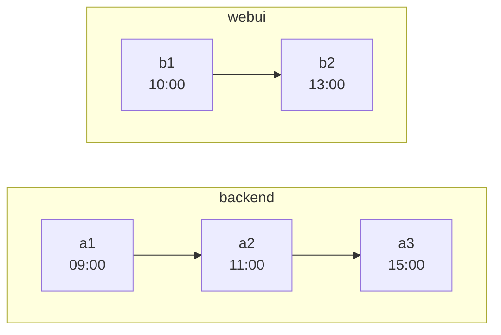
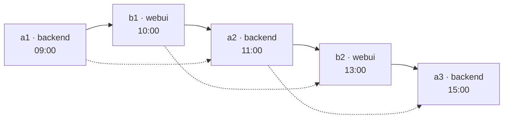

# git-timebraid

Merge several independent git repositories into one — **braided together along the time axis**.

- Every commit of every input repository is recreated.
- Every original parent edge is kept.
- On top of that, artificial edges chain commits *across* repositories in chronological order — by
  committer date, unless you ask for author date.

The result is a single mainline — *the braid* — that interleaves the histories of all inputs. Check
out any commit on it and you see the state that **all** input repositories had at that moment.

---

## The problem this solves

You have three repositories that were always developed together — a backend, a web UI, a code
generator. They were released together, they broke together, and the interesting question is almost
always *"what did the whole system look like on the day that bug appeared?"*

Git's usual answers do not give you that:

- `git subtree`, `git read-tree`, `git filter-repo --to-subdirectory-filter` and the plain
  `git merge --allow-unrelated-histories` recipe all join the repositories at a **single point**.
- From the merge commit onwards you have one repository — but every commit *before* it still belongs
  to exactly one original repository and shows only that repository's files.
- Your history is preserved, but it is not usable as a joint history.
- [josh](https://github.com/josh-project/josh) solves a different problem again — projecting
  subdirectories in and out as workspace views.

git-timebraid joins them **at every commit**.

---

## How it looks

Two repositories, one afternoon of work:



Braided:



- Solid arrows: the braided edges the tool adds.
- Dotted arrows: the original edges, all of them still there.
- Arrows point from parent to child, so time flows left to right.

Checking out `b2` gives you `backend/` as of `a2` and `webui/` as of `b2` — the state of the world at
13:00.

---

## How the braid is built

Three rules, in short:

- **Order.** Each input's mainline first-parent chain is a strand; the strands are merged into one
  sequence by always taking whichever strand's next commit is oldest by the **ordering timestamp** —
  the committer date, or the author date with `--order-by author`. A strand's own order is never
  disturbed, so ancestry within a repository holds by construction.
- **Parents.** The commit preceding `c` in that sequence is *prepended* to `c`'s parent list. Nothing
  is ever removed, so every original edge survives — and because the braided edge comes first,
  `git log --first-parent` walks the braid.
- **Trees.** A commit's tree is its first parent's tree with its own subdirectory swapped in. Content
  therefore accumulates along the braid: each subdirectory holds whatever its repository last
  committed at or before this point, and a repository that did not exist yet is simply not there.
  A subdirectory entry *is* the input's own tree object, so no blob is copied — the one file the braid
  writes for itself is the root `.gitmodules`, which git reads from nowhere else.

Which is where the promise at the top of this page comes from: that state is not computed when you
ask for it, it is what the commit already holds.

[**doc/how-it-works.md**](doc/how-it-works.md) works the construction out properly — the exact parent
rule, why a merge on the braid can end up with three parents, and what happens to side branches.
[**doc/examples/**](doc/examples/README.md) is the same thing on four small histories you can build
and walk yourself.

---

## What this buys you: bisecting across repositories

The point of all this is that **a moment in time becomes a commit you can check out**.

Say the nightly integration run was green on Tuesday and red on Friday. In between, `backend` gained
forty commits and `webui` gained twelve. The failure shows up in the UI, but nobody knows which side
actually caused it.

With separate repositories you cannot bisect that. You can bisect `backend` alone, but at each step
you have to decide by hand which `webui` commit was current at the time, check that one out too, and
hope you paired them correctly. Six bisect steps, and every one of them needs that pairing rebuilt by
hand.

In the braid it is the ordinary command, run in a clone of the output, since the output itself is
bare unless written with `--no-bare` and bisect wants a working tree to build in:

```bash
git bisect start --first-parent friday-commit tuesday-commit
# build and run the integration test at each step
git bisect run ./ci/integration-test.sh
```

Every commit git offers you along the first parent, which is the braid, is a real historical state of
the whole system: `backend/` holds whatever backend had last committed at that instant, `webui/`
likewise. Not an approximation and not a reconstruction — that combination is what existed. The
pairing is no longer something you maintain, and the commit bisect lands on tells you both *which
repository* and *which change*. A commit on a side branch is not such a state: it holds what its
fork point held plus the branch, which is why the bisect keeps to the first parent (git 2.29 or
later).

The same property answers the other questions of that shape without any tooling at all:

```bash
# what did webui ship on a given day
git show "$(git rev-list --first-parent -n1 --before=2024-03-15 main)":webui/package.json

# everything everyone did, as one timeline
git log --first-parent --since=2024-03-01

# what changed in the backend between two releases
git diff backend/release-2.1 backend/release-2.2 -- backend/
```

**Two limits on reading that literally.** "That instant" means the *mainline* branches as dated by
the ordering timestamp, not what was deployed; and a merge commit's tree can carry content timestamped
after the merge itself, which every later commit then inherits. Neither is something braiding
introduces, and both are worked through under [Caveats](doc/how-it-works.md#caveats).

---

## What ends up in the output repository

**One subdirectory per input repository**, named after the input's own name, which in turn defaults to
the last segment of its path. Name and placement are set separately:

- `repo.git::name` is the repository's **identity** — the tag prefix, the provenance label, what
  `--root-repo` matches, and what has to be unique. It is how two inputs whose directories happen to
  share a name are told apart.
- `repo.git=subdir` only says **where the content lands**.
- One repository may be placed at the root instead, with `--root-repo <name>`.

**All branches**, recreated at the corresponding new commits (restrict with `-b`):

- The mainline branch collapses into one: every input contributed its own to the same braid, so the
  output has a single branch of that name, at the braid's tip.
- Any other branch keeps its own name — unless two inputs happen to have used that name, in which
  case both are qualified as `<repo>/<branch>`.

**All tags**, prefixed with the repository name by default (`v1.2` from `webui` becomes `webui/v1.2`),
so tags from different repositories cannot collide. An annotated tag stays annotated, keeping its
tagger and its message.

**The original commits**, with their own shas intact, next to the rewritten ones. The output is
filled by fetching each input into it whole — that is what puts the inputs' trees and blobs there,
which the braid then reuses — and a fetch cannot leave the commits out. Nothing points at them by
default, so they are invisible to `git log` and `git gc --prune=now` reclaims them; `--keep-remotes`
points `refs/remotes/<repo>/*` at every branch and — under `tags/` — every tag of each input
instead, which reaches all of them, so the originals stay one `git log` away. Either way the fetch
covers the refs that were read, so `-b` narrows what arrives, too.

**A provenance trailer** on every commit message:

```
webui: fix the date picker on the summary page

[timebraid: repo="webui" commit=5c1a9f2… parents=b2c91f4…,a0d3e11…]
```

This is what makes the guarantee checkable rather than merely claimed: the original identity and the
original parents of every commit are recorded, so a script can verify that no edge went missing. Turn
it off with `--no-provenance`.

---

## Usage

### Requirements

- Java 17 or newer
- `git` on `PATH` — only to clone a remote input and to check out a `--no-bare` output; reading the
  inputs, transferring their objects and writing the braid all happen in-process

### Install

Download an archive from [Releases](https://github.com/loplex/git-timebraid/releases), unpack it, and
put its `bin/` on `PATH`:

```bash
tar xzf git-timebraid-<version>.tar.gz -C ~/opt
export PATH="$HOME/opt/git-timebraid-<version>/bin:$PATH"

git-timebraid --help
git timebraid --help                 # the same thing: git runs any git-<name> found on PATH
```

Each release carries a `SHA256SUMS`; `sha256sum --check --ignore-missing SHA256SUMS` verifies what
you downloaded against it.

Building from source produces the same archive:

```bash
mvn -q package                       # builds target/git-timebraid-<version>.tar.gz (and .zip)
```

The archive is `bin/git-timebraid` (plus `git-timebraid.bat` for Windows) beside
`lib/git-timebraid.jar`. The launcher finds the jar relative to itself, through symlinks, so linking
`bin/git-timebraid` into a directory already on `PATH` works too.

The JVM is picked in this order, first hit wins:

1. `TIMEBRAID_JAVA` — names a java binary outright
2. `runtime/` beside the launcher — present only in the bundled-runtime archive (see below)
3. `JAVA_HOME`
4. `java` from `PATH`

`JAVA_OPTS` goes to the JVM, which is where a larger heap belongs for a large history:

```bash
JAVA_OPTS=-Xmx4g git-timebraid -o /tmp/merged ~/repos/backend.git ~/repos/webui.git
```

The jar is self-contained (all dependencies shaded in), so skipping the archive works as well:

```bash
java -jar target/git-timebraid.jar --help
```

#### Without a JVM installed

`-Pbundled-runtime` adds a second archive carrying a trimmed JVM built with `jlink`, for machines
where installing Java is not on the table:

```bash
mvn -q -Pbundled-runtime package      # adds git-timebraid-<version>-<os>-<arch>.tar.gz (and .zip)
```

- It unpacks and runs the same way; the launcher notices `runtime/` beside it and uses that JVM in
  preference to `JAVA_HOME`, which is the point of the archive.
- `TIMEBRAID_JAVA=/path/to/java` overrides that when you would rather it ran on yours.
- Roughly 46 MB unpacked against 9 MB for the plain jar.
- Unlike the plain archive it only runs on the platform that built it — hence the platform in the
  file name.
- It is the JDK running Maven that gets bundled, and `--compress=zip-6` needs JDK 21 or newer; on
  JDK 17 build it with `-Djlink.compress=2`.

### Examples

Merge three local bare clones, each into its own subdirectory:

```bash
git-timebraid -o /tmp/merged \
    --mainline-branch develop \
    ~/repos/backend.git ~/repos/webui.git ~/repos/codegen.git
```

Put the backend at the repository root and place `webui` in `ui/`, keeping its own name (so its
tags stay `webui/v1.2`):

```bash
git-timebraid -o /tmp/merged \
    --root-repo backend --mainline-branch main \
    ~/repos/backend.git ~/repos/webui.git=ui ~/repos/codegen.git
```

Recreate only two branches, and inspect the plan without writing anything:

```bash
git-timebraid \
    --mainline-branch main \
    -b main -b release/2.2 \
    --dry-run --plan-out /tmp/plan.txt \
    ~/repos/backend.git ~/repos/webui.git
```

### Options

```
git-timebraid -o <dir> [OPTIONS] <repo>[::<name>][=<subdir>]...

  -o, --output DIR              output repository (must not exist unless --force)
      --force                   write into an existing output directory (deletes nothing)
      --root-repo REPO          repository whose content lands at the repository root
      --mainline-branch NAME    branch treated as the mainline in every input
                                (default: first of main/master/develop present in all)
      --order-by author|committer
                                timestamp used to interleave the strands
                                (default: committer)
  -b, --branch NAME             recreate only these branches (repeatable; default: all)
      --interleave-ref PATTERN  let this ref's commits delay a mainline merge that merges
                                them in (repeatable; glob over full ref names; default: none)
      --tag-prefix FMT          default "{repo}/"
      --subject-prefix FMT      default "{subdir}: "
      --[no-]provenance         provenance trailer (default: on)
      --bare / --no-bare        default: bare
      --keep-remotes            add inputs as remotes, their branches at their original
                                commits under refs/remotes/<repo>/*
      --dry-run                 compute and summarize the plan, write nothing
      --plan-out FILE           dump the deterministic plan as text
  -q, --quiet / -v, --verbose
```

---

## Status

**Usable from the command line end to end.** Implemented and tested:

- Cloning the inputs — a local path or a URL — reading them, and planning the interleaving.
- Writing the output, bare or with a working tree.
- Recreating every branch and prefixed tag, the provenance trailer, keeping the inputs as remotes,
  and progress on stderr.
- A URL input is cloned next to the output under `.timebraid-clones/`; a second run over the same URL
  refreshes that clone instead of downloading it again.

Verification:

- A matrix of end-to-end fixtures — a three-parent merge on the mainline, `--root-repo`, side
  branches, committer-clock skew, tree dedup, `a.txt` vs `a/` ordering, CRLF and non-ASCII content,
  the error paths — each run through `git fsck --strict`.
- An opt-in smoke run against a real corpus. On a three-repository history of 14 000 commits the
  result passes `git fsck --strict`, and walking the provenance trailers finds every original parent
  edge present in the output.
- CI runs `mvn verify` on Linux and Windows against JDK 17 and 21, and on each of those also
  builds the bundled-runtime archive and merges two repositories with the launcher inside it.

`mvn package` produces the runnable artifacts: a self-contained jar and a `tar.gz`/`zip` holding it
together with the `git-timebraid` launcher, plus, under `-Pbundled-runtime`, a platform-specific
archive with a `jlink` runtime for machines without a JVM (see Install).

Releases are cut by tagging: CI builds the portable archive, the jar, and one archive per platform
(Linux, macOS and Windows on x64, Linux and macOS on aarch64), merges two repositories with each one
to check it runs, and uploads them with a `SHA256SUMS`. What changed between releases is in
[CHANGELOG.md](CHANGELOG.md).

## Limitations

- **Commit SHAs change.** Rewriting parents rewrites identity; this is unavoidable and permanent. Use
  the provenance trailer to map new commits back to the originals.
- **GPG signatures do not survive.** A signature covers the parent list, so rewriting parents
  invalidates it. Signatures are dropped rather than kept in an invalid state.
- **Inputs must be complete clones.** Shallow clones and partial clones are rejected — the tool needs
  the entire commit graph.
- **Subdirectory names must not collide** with entries of the `--root-repo` at its top level.
- **The whole commit graph is held in memory.** Hundreds of thousands of commits will want a larger
  heap. This is a batch tool run once per merge, not a daemon.
- **The output holds the inputs' original commits unreferenced.** They arrive with everything else
  the fetch brings and nothing points at them unless `--keep-remotes` does, so `git fsck` reports
  them as `dangling commit` until a `git gc --prune=now` reclaims them. On a 139 MB corpus they are
  3 MB of the 97 the output takes.
- **A submodule's relative `url` stops resolving.** Submodules are carried over and rewired — the
  output gets a root `.gitmodules` whose paths point at where each gitlink landed, so
  `git submodule update --init` works (see [the tree rule](doc/how-it-works.md#the-one-exception-gitmodules)).
  What cannot be rewired is a **relative** url such as `../lib.git`: git resolves those against the
  superproject's own remote, and the output's remote is not the input's. Make them absolute in the
  inputs before merging.
- **Not transferred:** `refs/notes/*`, reflogs, and any repository-local configuration.

## License

Apache License 2.0 — see [LICENSE](LICENSE) and [NOTICE](NOTICE).
